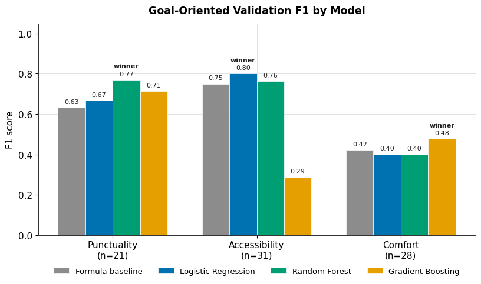
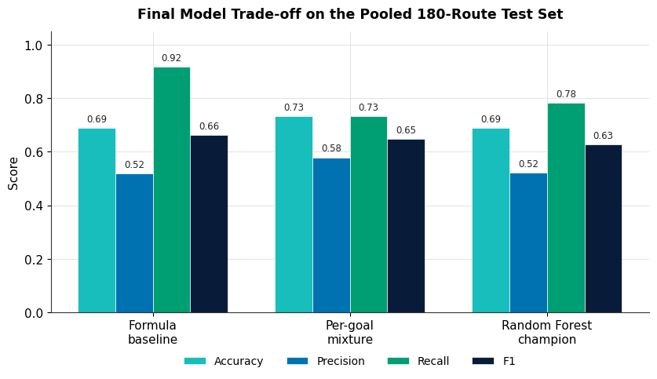
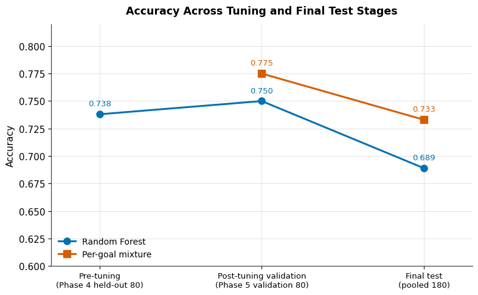
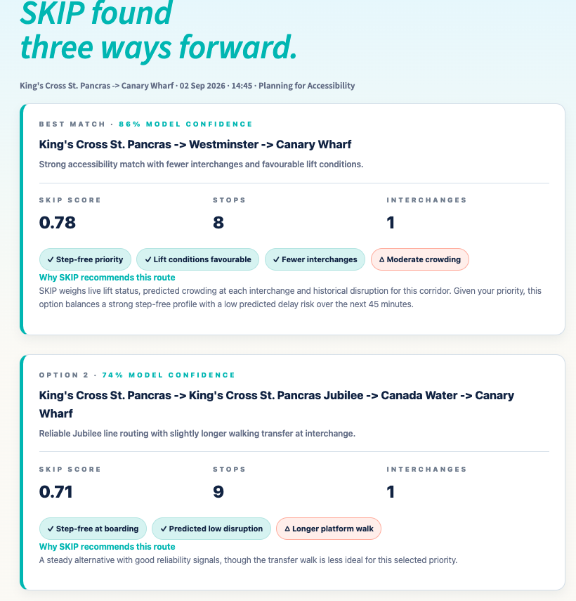

<p align="center">
  
</p>

<h1 align="center">SKIP — Intelligent Journey Recommendation System</h1>

<p align="center">
  <b>An accessibility-aware London Underground journey planner combining graph-based routing, machine learning and interpretable scoring to recommend journeys around Punctuality, Accessibility and Comfort.</b>
</p>

> **Project role:** Team Lead · Streamlit Frontend · ML Evaluation · Final Integration

## Quick Links

<p align="center">
  <a href="docs/case-study.md">Full Case Study</a> •
  <a href="notebooks/skip-modelling.ipynb">Modelling Notebook</a> •
  <a href="notebooks/evaluation-figures.ipynb">Evaluation Figures</a> •
  <a href="app/README.md">Run Prototype</a> •
  <a href="https://github.com/sarahnish/portfolio">Project Portfolio</a>
</p>

---

## At a Glance

| Network | Human-labelled routes | ML features | Final evaluation | Data sources |
|---|---:|---:|---:|---:|
| **272 stations · 313 edges** | **400** | **10** | **180 routes** | **7 streams** |

### How It Works

**Goal-specific ML specialists rank routes → PAC formula explains and protects → honesty flags communicate uncertainty.**

SKIP supports three passenger priorities:

- **Punctuality**
- **Accessibility**
- **Comfort**

Given an origin, destination and passenger priority, SKIP:

| Step | Action | Technique |
|---|---|---|
| 1. **Generate** | Build candidate routes across the Underground network | k-shortest paths on a 272-station NetworkX graph |
| 2. **Score & Rank** | Evaluate route suitability for the selected goal | Random Forest / Logistic Regression / Gradient Boosting specialist |
| 3. **Recommend** | Return ranked routes with explanations and safety checks | PAC scoring + model confidence + honesty flags |

### Key Results

**92% recall** (PAC baseline) · **73% accuracy** (per-goal mixture) · **66% agreement** with human judgement · **Top 5** candidates generated · **Top 3** recommendations shown

---

## Tech Stack

| Layer | Technologies |
|---|---|
| **Language** | Python 3.12 |
| **Machine Learning** | scikit-learn |
| **Deep Learning** | PyTorch |
| **Data Processing** | pandas, NumPy |
| **Time Series** | statsmodels (SARIMA) |
| **Graph Processing** | NetworkX |
| **Frontend** | Streamlit |
| **Visualisation** | Matplotlib |
| **Data Integration** | TfL Open Data APIs |
| **Development** | Jupyter, Google Colab, Git, GitHub |

---

## The Problem

Traditional journey planners tend to prioritise journey efficiency and travel time.

For passengers with mobility requirements, however, the fastest route may still contain practical barriers such as:

- inaccessible stations
- out-of-service lifts
- difficult interchanges
- disruption
- high crowding
- uncomfortable journey conditions

> **Core Research Question:**  
> *Can a predictive journey planner better reflect passenger priorities while providing transparent and trustworthy route explanations?*

---

## Overview

SKIP combines graph-based routing, human-labelled route suitability and predictive modelling to explore a more passenger-centred approach to London Underground journey planning.

The system does not simply search for the shortest route. Instead, it evaluates alternative routes according to the passenger's selected **Punctuality, Accessibility or Comfort** goal.

The final design is hybrid:

**Machine learning determines ranking, while the deterministic PAC framework provides interpretable scoring, explanation and recall-oriented protection.**

---

## Approach

SKIP combines:

1. **Graph-based routing** — k-shortest paths across a 272-station NetworkX graph
2. **Human-labelled data** — 400 candidate routes evaluated for passenger suitability
3. **Interpretable PAC scoring** — deterministic goal-dependent route scoring
4. **Goal-specific ML** — specialist models selected for Punctuality, Accessibility and Comfort
5. **Safety-aware serving** — recall protection and honesty flags for uncertain recommendations
6. **Streamlit prototype** — passenger-facing interface presenting ranked routes, confidence and trade-offs

---

## Key Features

- **Graph-based routing** across **272 London Underground stations** and **313 network edges**
- **10 route-level ML features** derived from accessibility, congestion, transfer and operational signals
- **Goal-specific ML ranking** for Punctuality, Accessibility and Comfort
- **7 integrated TfL data streams** — 4 APIs and 3 official static datasets
- **Caching and persistent API rate limiting** for reproducible data ingestion
- **Safety-aware recommendation logic** using a PAC recall safeguard (`NET_FLOOR = 0.2`) and honesty flags
- **Frozen TfL modelling snapshot** dated **2026-07-06**
- **Passenger-facing Streamlit prototype** with a colour-blind-friendly interface
- **Leakage-controlled evaluation** separating model selection from final testing
- **100-route external evaluation set** alongside the held-out development evaluation

---

## Key Findings

### 1. Different passenger goals needed different models

| Goal | Selected Specialist |
|---|---|
| **Punctuality** | Random Forest |
| **Accessibility** | Logistic Regression |
| **Comfort** | Gradient Boosting |

<p align="center">
  
</p>

**Takeaway:** one universal classifier did not capture every passenger priority equally well. The evidence instead supported a **per-goal specialist architecture**.

---

### 2. Machine learning did not make the interpretable baseline obsolete

<p align="center">
  
</p>

Final evaluation:

- **PAC formula:** highest recall — **0.92**
- **Per-goal mixture:** highest accuracy — **0.73**
- **Random Forest:** strongest general learned model

**Takeaway:** This motivated a hybrid architecture rather than replacing deterministic reasoning entirely approach. ML added value for personalised ranking, while the PAC framework remained valuable for recall and explanation.

---

### 3. Validation improvements did not fully generalise

<p align="center">
  
</p>

The per-goal mixture reached **0.775 validation accuracy** but **0.733 on the final pooled evaluation**.

**Takeaway:** The per-goal mixture reached **0.775 validation accuracy** but **0.733 on the final pooled evaluation**. The stronger validation performance did not automatically translate into stronger performance on untouched data, reinforcing the importance of held-out evaluation.

---

## Prototype

<p align="center">
  
</p>

I built the passenger-facing **Streamlit frontend (`app.py`)**, including:

- journey inputs
- PAC goal selection
- ranked recommendation cards
- model-confidence presentation
- PAC scores
- accessibility indicators
- compromise handling for lower-confidence recommendations

[View prototype instructions →](app/README.md)

---

## Benchmark

SKIP was benchmarked against the TfL Journey Planner across **20 representative journeys**.

The submitted evaluation found no statistically significant difference in mean route stops or interchanges, suggesting that SKIP produced structurally comparable routes while optimising for a different objective: **passenger-specific suitability rather than travel time alone**.

[Read the full evaluation →](docs/case-study.md)

---

## Models Evaluated

| Model | Role | Key Finding |
|---|---|---|
| **PAC Formula** | Deterministic baseline | **91.7% final recall** and fully interpretable scoring |
| **Logistic Regression** | Linear benchmark | Selected specialist for **Accessibility** |
| **Random Forest** | Non-linear ensemble | Selected specialist for **Punctuality** and strongest general learned model |
| **Gradient Boosting** | Boosted-tree model | Selected specialist for **Comfort** during validation |
| **Neural Network (M1)** | Deep-learning experiment | Investigated in PyTorch but not retained in the final ranking configuration |
| **Per-goal Specialist Mixture** | **Final ML ranking approach** | Uses a different specialist for each PAC goal |

---

## Final Design

```text
Candidate Routes
      ↓
Goal-Specific ML Specialist
      ↓
Probability-Based Ranking
      ↓
PAC Formula
      ↓
Explanation + Recall Protection
      ↓
Confidence / Honesty Flags
      ↓
Top 3 Recommendations
```

> **ML ranks. PAC explains. The safety layer protects.**

---

## Explore Further

| Resource | What you'll find |
|---|---|
| **[Full Case Study](docs/case-study.md)** | Problem framing, methodology, detailed findings, evaluation, limitations and design decisions |
| **[Modelling Notebook](notebooks/skip-modelling.ipynb)** | Full modelling and recommendation pipeline |
| **[Evaluation Notebook](notebooks/evaluation-figures.ipynb)** | Code used to reproduce the evaluation figures |
| **[Evaluation Results](results/README.md)** | Exported model-performance figures |
| **[Streamlit App](app/README.md)** | Prototype setup and local run instructions |

---

## My Contribution

SKIP was developed as a **collaborative MSc Artificial Intelligence project at Queen Mary University of London**.

As **Team Lead**, I:

- **originated the project concept**
- **coordinated the team and overall project direction**
- **built the passenger-facing Streamlit application (`app.py`)**
- **supported model evaluation and interpretation of results**
- **contributed to final-stage coding, debugging and integration**
- **shaped the project framing, introduction and related work**
- **helped communicate the accessibility, explainability and responsible-AI motivation**

The project gave me experience across both the **technical and decision-making sides of an AI project** — from problem framing and team leadership to application development, evaluation and communicating model limitations.

## Project Context

SKIP is an academic research prototype and is **not affiliated by Transport for London**.
